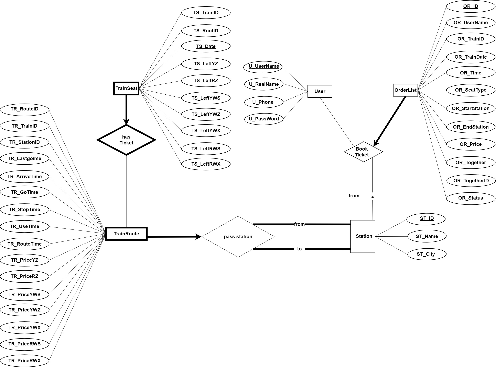

[TOC]

## 数据库系统LAb2实验报告

#### 成员组成


#### 1.ER图

总ER图如下：




#### 2.关系模式

##### 用户表 users

​		该表信息如下,将主键设置为用户名，订单只针对用户名，方便处理

```mysql
create table Users(                          --用户表
    U_UserName varchar(20) unique,           --用户名    
    U_RealName varchar(20) not null,         --真实名字
    U_Phone  char(11) unique not null,       --电话号码
    U_PassWord varchar(20) not null,         --密码
    primary key (U_UserName)                 --主键
)default charset = utf8;
```

##### 车站表 station

​		记录了车站对应的城市，以车站为主键，因为车站名是唯一的

```mysql
create table Station(              --车站表
    ST_ID   int,                   --序号
    ST_Name varchar(20),           --车站名
    ST_City varchar(10),           --所在城市
    primary key (ST_Name)
)default charset = utf8;
```

##### 列车路段表 trainroute

​		我们设计车次存储时按照路段的形式记录每一个路段，每一个路段仅记录终点站名，为每一路段编号，出发时间、结束时间、票价等都只针对上一站来说，不售票的站票价设置为0，以路段编号Tr_RouteID和车次编号TR_TrainID做主键唯一确定一项，外键TR_StationID关联station表的ST_Name是为了通过城市找到车站

```mysql
create table TrainRoute(         --列车表
    TR_RouteID int,              --路段编号
    TR_TrainID varchar(10),      --车次 
    TR_StationID varchar(20),    --该站信息     
    TR_LastgoTime time,          --初始站出发日期
    TR_ArriveTime time,          --结束站到达时间
    TR_GoTime     time,          --结束站出发时间
    TR_StopTime   int,           --停留时间(用来算发车时间)

    TR_UseTime    int,           --始发站到此站历时
    TR_RouteTime  int,           --本段历时(不卖票的站也有发时和到时)

    TR_PriceYZ  float,           --该路径的票价格(允许为0，用来路径相加)
    TR_PriceRZ  float,           --出发站的票价不允许为负数，价格0用来阻止终点和起点
    TR_PriceYWS float,
    TR_PriceYWZ float,
    TR_PriceYWX float,
    TR_PriceRWS float,
    TR_PriceRWX float,
    primary key (TR_TrainID, Tr_RouteID),
    foreign key (TR_StationID) references Station(ST_Name)
)default charset = utf8;
```

##### 座位信息表 trainseat

​		座位信息表用来记录每一个路段的余票，主键是车次号TS_TrainID，路段编号TS_RouteID号，车次日期TS_Date ，因为日期直接影响余票量，所以将TS_Date设置为主键，同时外键TS_RouteID和TS_TrainID关联TrainRoute表的TR_TrainID,TR_RouteID，确保路段余票和价格的对应。

```mysql
create table TrainSeat               --座位信息表
(               
    TS_TrainID    varchar(10),       --车次
    TS_RouteID    int,               --路段编号
    TS_Date       date,              --车次日期

    TS_LeftYZ  int,                  --路段剩余座位  
    TS_LeftRZ  int,
    TS_LeftYWS int,
    TS_LeftYWZ int,
    TS_LeftYWX int,
    TS_LeftRWS int,
    TS_LeftRWX int,
    primary key(TS_TrainID,TS_RouteID,TS_Date),
    foreign key(TS_TrainID,TS_RouteID)REFERENCES TrainRoute(TR_TrainID,TR_RouteID)
)default charset = utf8;
```

##### 订单表OrderList

​		该表主键是订单号，外键是用户名。为了处理中转票的问题，我们加入联票单确认信息OR_Together，以及联票单的订单号OR_TogetherID。

```mysql
create table OrderList(                 
    OR_ID    int,                       --id
    OR_UserName varchar(20) not null,   --用户名
    OR_TrainID  varchar(10) not null,   --车次
    OR_TrainDate date not null,         --日期
    OR_Time datetime not null,          --订单下单时间
    OR_SeatType int not null,           --座位类型
    /*
    1.硬座2.软座
    3.硬卧上4.硬卧中5.硬卧下
    6.软卧上7.软卧下
    */
    OR_StartStation varchar(20) not null,--出发站
    OR_EndStation   varchar(20) not null,--终点站
    OR_Price  float not null,            --票价
    -- 联票中转
    OR_Together int not null,            --是否联票单
    OR_TogetherID int                    --联票订单号
    OR_Status int not null,              --订单状态
    /*
    0.取消
    1.预定
    */
    primary key (OR_ID),
    foreign key(OR_UserName) references Users(U_UserName)
)default charset = utf8;
```


#### 3.范式细化分析

##### 1.用户users

Users(                   
    U_**U**serName,    
    U_R**e**alName,     
    U_Ph**o**ne,     
    U_Pass**W**ord ,                
);

​		用户名和手机号都可以唯一确定一个用户,U和e作为候选键,函数依赖为u->eow,o->uow,没有复合键不存在部分依赖,都是直接推导,没有非键传递依赖,推导左侧只有键属性,不存在对于键属性的函数依赖,因此是BCNF.

##### 2.车站表Station

Station(             
    ST_ **I**D ,          
    ST_ **N**ame ,   
    ST_ **C**ity ,       
);

​		车站id和车站表名Name都能唯一确定对应的城市,I和N作为候选键,函数依赖为I->NC,N-IC,和users表相同没有部份依赖,传递依赖和对于键属性的函数依赖,因此也为BCNF.

##### 3.列车路段表 trainroute

TrainRoute(    

  TR_**R**outeID ,  

  TR_**T**rainID,  

  TR_**S**tationID ,  

  TR_**L**astgoTime,    

  TR_**A**rriveTime,    

  TR_**G**oTime,      

  TR_Sto**p**Time ,     

  TR_**U**seTime ,     

  TR_R**o**uteTime,      

  TR_Pric**e** ,      --各种座位价格的统一表示

);

​		候选键为路段和车次的组合RT或者车次和车站名TS,同时route是一个车次运行经过不同的路段,所以路段id不能得到车站名,一个车站名字也会在不同的车次经过的路中对应不同的路段,因此车站也不能决定路段id,因此函数依赖关系为RT->SLAGPUoe, TS->RLAGPUoe,存在复合键,但并不存在部分依赖,因为同一车次在不同路段或不同车站对应的LAGPUoe显然是不一定相同的.显然,传递依赖也是不存在的,函数依赖左侧都是候选键,因此没有对于键属性的函数依赖,所以trainroute满足BCNF.

##### 4.座位信息表 trainseat

TrainSeat  (        

  TS_**T**rainID,     

  TS_**R**oute ,      

  TS_**D**ate,       

  TS_**L**eft ,         

);

​		座位信息表的候选键只有一个也就是它的主键TS_TrainID,TS_Route,TS_Date,因此非键属性只有剩余座位数量,函数依赖为TRD->L,显然该关系模式满足BCNF.

##### 5.订单表OrderList

OrderList(         

  OR_**I**D int,  

  OR_UserName ,  

  OR_TrainID ,  

  OR_TrainDate,     

  OR_Time ,    

  OR_SeatType ,      

  OR_StartStation,

  OR_EndStation  ,

  OR_Price ,      

  OR_Together,   

  OR_MidTrainID,     

  OR_MidEndStation ,

  OR_MidStartStation ,

  OR_Status,  

);

​		主键订单号OR_ID决定其他所有值,因此函数依赖为I -> orther(orther为其他全部的属性),关系模式满足BCNF.

#### 4.SQL语句分析

##### 需求3：记录乘客信息

###### 信息插入

​		将用户的真实姓名、手机号、用户名、密码插入表中

```mysql
INSERT INTO users VALUES('{$realname}','{$idcard}','{$phone}','{$creditcard}','{$username}','{$password}')
```

###### 登录验证

​		查找到用户名之后分别进行用户认证和管理员认证，最后根据用户查找对应密码认证

```mysql
select u_username from users where u_username = '{$username}'
select u_password from users where u_password = '{$password}' and u_username = '{$username}' 

```

##### 需求4：查询具体车次

​		查找具体车次的时候，网页输入的是车次号TrainID和日期。

​        我们SQL语句的思路是寻找匹配的TrainID和日期并输出。

​		具体实现上，我们需要从trainseat begin_ts里面找到我们需要的车次的每个站信息，从trainroute begin_tr里面找到我们需要的对应日期下对应票的余额，因为我们每一项存储的是单段路径的信息，所以还需要一个trainseat pass_ts表和trainroute pass_tr表用来求出比当前的段小的所有的段，将他们的票价相加得到始发站到本站的票价，取他们票余量的最小值作为初始站到本站的余量，最后根据TrainID分组即可得到具体的车次信息，SQL查询语句如下（我们只给出了硬座的情况，其他座位的详细信息只需将硬座改成其他座位类型即可）：

```mysql
select
        begin_tr.TR_StationID as'到达站',
        begin_tr.TR_ArriveTime as'到达时间',
        begin_tr.TR_GoTime as '出发时间',
        sum(pass_tr.TR_PriceYZ) as'票价',
        min(pass_ts.TS_LeftYZ) as'票余额'
from
        trainseat begin_ts,
        trainseat pass_ts,
        trainroute begin_tr,
        trainroute pass_tr
where
        begin_tr.TR_TrainID = begin_ts.TS_TrainID and
        begin_tr.TR_RouteID = begin_ts.TS_RouteID and
        begin_tr.TR_TrainID = '1095' and begin_ts.TS_Date = '2022-04-26' and
        pass_ts.TS_Date = begin_ts.TS_Date and pass_ts.TS_RouteID = pass_tr.TR_RouteID and
        pass_tr.TR_TrainID =  pass_ts.TS_TrainID and
        pass_tr.TR_RouteID <= begin_tr.TR_RouteID and
        pass_tr.TR_PriceYZ >=0 and
        pass_tr.TR_TrainID = begin_tr.TR_TrainID
group by
       begin_tr.TR_RouteID
order by
       begin_tr.TR_RouteID;
```


##### 需求5：查询两地之间的车次（包括需求6：查询返程信息）

###### 直达车次查询

​		网页输入给我们的信息是出发地城市名和到达地的城市名，出发日期和出发时间。

​		查询思路就是找到同一车次下匹配起点和终点信息的路段，将路段的票价加起来得到总票价，取路段票价余量的最小值作为该路段剩余票量。

​       具体实现上，我们用了7个表进行查询，包括3个trainroute表、2个trainseat表和2个station表，trainroute   begin_tr表用来匹配首发站，trainroute   end_tr用来匹配结束站，trainroute   pass_tr用来匹配中间站，trainseat    first_ts用来匹配第一个区间的余座信息，trainseat    pass_ts用来匹配中间路段的余座信息，station  A用来匹配查询起点，station B用来匹配查询终点，对于包含跨天的路段，我们将中间车次的时间与第一个区间的时间匹配保证日期的一致性，通过起始站的车次和出发时间分组，将中间段的票价格求和得到路程总的价格，中间段余票量的最小值作为该段的余票量，按照先票价、再行程总时间、最后起始时间排序显示前十的车次。SQL语句如下：（同样只展示了硬座的情况，其他情况将硬座处替换为响应座位即可）。

```mysql
select
  begin_tr.TR_StationID '始发站',
  end_tr.TR_StationID '终点站',
  begin_tr.TR_TrainID '车次',
  sum(pass_tr.TR_PriceYZ) price,
  min(pass_ts.TS_LeftYZ) '余票',
  sum(pass_tr.TR_RouteTime) all_time,
  begin_tr.TR_GoTime begin_time
  /*车次、票价、剩余座位、行程时间、起始时间*/
from
  station as A,
  station as B,
  trainroute as begin_tr,
  -- 首发站
  trainroute as end_tr,
  -- 终点站
  trainroute as pass_tr,
  -- 中间站
  trainseat as first_ts,
  -- 第一个区间余票
  trainseat as pass_ts -- 全部区间余票
where
  begin_tr.TR_TrainID = end_tr.TR_TrainID
  and begin_tr.TR_StationID = A.ST_Name
  and A.ST_City = '北京'   --出发站
  and end_tr.TR_StationID = B.ST_Name
  and B.ST_City = '郑州'   --终点站
  and begin_tr.TR_RouteID < end_tr.TR_RouteID 
  and begin_tr.TR_GoTime > '00:00' -- 出发时间
  and pass_tr.TR_TrainID = begin_tr.TR_TrainID
  and pass_tr.TR_RouteID > begin_tr.TR_RouteID
  and pass_tr.TR_RouteID <= end_tr.TR_RouteID  -- 中间站
  and first_ts.TS_TrainID = begin_tr.TR_TrainID
  and first_ts.TS_RouteID = begin_tr.TR_RouteID
  and first_ts.TS_Date = '2022-05-01'    -- 出发日期
  and pass_ts.TS_TrainID = begin_TR.TR_TrainID
  and pass_ts.TS_RouteID = pass_tr.TR_RouteID
  and pass_ts.TS_Date = first_ts.TS_Date -- 中间区间时间匹配
group by
  begin_tr.TR_TrainID,
  begin_tr.TR_GoTime
having
  min(pass_ts.TS_LeftYZ) != 0  -- 票余额不为0
order by
  price,
  all_time,
  begin_time asc
limit
  10;
```


###### 换乘车次查询

​		换乘车次的查询是基于上面直达车次的查询的。

​		利用上面直达车次查询查出起始城市下指定日期所有车次下输入目标站可以直达的站存放在route A作为中转的第一段，再利用直达车次查询查出起始城市指定日期以及指定日期后一天的所有车次下可以直达目的终点站的信息存放在route B作为中转的第二段，查终点站的出发站查了两天是考虑到了车次以及换乘跨夜的情况，在查出来的两个表的基础上进行笛卡尔乘积，取出A的终点城市和B的起点城市相同的项，如果车站相同，那么换乘时间在1到4小时，如果车站不同那么换乘时间在2到4小时。假设列车运行不会超过2天，那么我们用第一段到达时间减去出发时间如果得到负数说明跨夜，如果没得到负数用第二段的出发时间减去第一段的出发时间得到负数说明跨夜，否则没有跨夜。对于跨夜的情况需要选取第二段第二天的车次，否则与第一段是同一天，换乘时间由第二段的出发时间减去第一段的到达时间得到，负数的项需要加24小时，最后将换乘时间符合条件且有余票的条目按照先票价、再行程总时间、最后起始时间排序显示前十项。SQL语句如下：（只展示了均为硬座的情况，其他情况将硬座处替换为相应座位即可）。

```mysql
select
  routeA.始 发 站 '段1起点',
  (routeA.price + routeB.price) as price,
  routeA.price '段1票价',
  routeB.price '段2票价',
  routeA.begin_time as begin_time,
  (routeA.all_time + routeB.all_time) as all_time,
  routeA.arrrive_time '段1到达',
  routeB.begin_time '段2发车',
  (
    case
      when (
        timediff(routeB.begin_time, routeA.arrrive_time) < '00:00:00'
        and routeB.DDate = '2022-05-02'
      ) then timediff(
        routeB.begin_time,
        timediff(routeA.arrrive_time, '24:00:00')
      )
      else timediff(routeB.begin_time, routeA.arrrive_time)
    end
  ) '换乘时间',
  routeA.终点站 '段1终点',
  routeA.车次 '段1车次',
  routeB.begin_st '段2起点',
  routeB.end_st '段2终点',
  routeB.TrainID '段2车次'
from
  (
    select
      begin_tr.TR_StationID '始发站',
      end_tr.TR_StationID '终点站',
      begin_tr.TR_TrainID '车次',
      B.ST_City '城市',
      sum(pass_tr.TR_PriceYZ) price,
      min(pass_ts.TS_LeftYZ) '余票',
      sum(pass_tr.TR_RouteTime) all_time,
      begin_tr.TR_GoTime begin_time,
      end_tr.TR_ArriveTime arrrive_time,
      first_ts.TS_Date as Adate
    from
      station as A,
      station as B,
      trainroute as begin_tr,
      -- 首发站
      trainroute as end_tr,
      -- 终点站
      trainroute as pass_tr,
      -- 中间站
      trainseat as first_ts,
      -- 第一个区间余票
      trainseat as pass_ts -- 全部区间余票
    where
      begin_tr.TR_TrainID = end_tr.TR_TrainID
      and begin_tr.TR_StationID = A.ST_Name
      and A.ST_City = '北京'                 -- 出发城市
      and end_tr.TR_StationID = B.ST_Name
      and begin_tr.TR_RouteID < end_tr.TR_RouteID  
      and begin_tr.TR_GoTime > '00:00'       -- 出发时间
      and pass_tr.TR_TrainID = begin_tr.TR_TrainID
      and pass_tr.TR_RouteID > begin_tr.TR_RouteID
      and pass_tr.TR_RouteID <= end_tr.TR_RouteID 
      and first_ts.TS_TrainID = begin_tr.TR_TrainID
      and first_ts.TS_RouteID = begin_tr.TR_RouteID
      and first_ts.TS_Date = '2022-05-01'     -- 出发日期
      and pass_ts.TS_TrainID = begin_TR.TR_TrainID
      and pass_ts.TS_RouteID = pass_tr.TR_RouteID
      and pass_ts.TS_Date = first_ts.TS_Date 
    group by
      begin_tr.TR_TrainID,
      end_tr.TR_RouteID,
      begin_tr.TR_GoTime
    having
      min(pass_ts.TS_LeftYZ) != 0
      and price != 0
  ) as routeA,
  /*到达终点B的车站*/
  (
    select
      begin_tr.TR_StationID begin_st,
      end_tr.TR_StationID end_st,
      begin_tr.TR_TrainID TrainID,
      A.ST_City City,
      sum(pass_tr.TR_PriceYWS) price,
      min(pass_ts.TS_LeftYWS) last,
      sum(pass_tr.TR_RouteTime) all_time,
      begin_tr.TR_GoTime begin_time,
      first_ts.TS_Date DDate
      /*车次、票价、剩余座位、行程时间、起始时间*/
    from
      station as A,
      station as B,
      trainroute as begin_tr,
      -- 首发站
      trainroute as end_tr,
      -- 终点站
      trainroute as pass_tr,
      -- 中间站
      trainseat as first_ts,
      -- 第一个区间余票
      trainseat as pass_ts -- 全部区间余票
    where
      begin_tr.TR_TrainID = end_tr.TR_TrainID -
      and begin_tr.TR_StationID = A.ST_Name
      and A.ST_Name != B.ST_Name 
      and end_tr.TR_StationID = B.ST_Name
      and B.ST_City = '郑州'                       -- 目的地
      and begin_tr.TR_RouteID < end_tr.TR_RouteID 
      and begin_tr.TR_GoTime > '00:00'            -- 发车时间
      and pass_tr.TR_TrainID = begin_tr.TR_TrainID 
      and pass_tr.TR_RouteID > begin_tr.TR_RouteID
      and pass_tr.TR_PriceYWS >= 0
      and pass_tr.TR_RouteID <= end_tr.TR_RouteID 
      and first_ts.TS_TrainID = begin_tr.TR_TrainID
      and first_ts.TS_RouteID = begin_tr.TR_RouteID
      and (
        first_ts.TS_Date = '2022-05-02'
        or first_ts.TS_Date = '2022-05-01'
      )                                           -- 查两天的
      and pass_ts.TS_TrainID = begin_TR.TR_TrainID
      and pass_ts.TS_RouteID = pass_tr.TR_RouteID
      and pass_ts.TS_Date = first_ts.TS_Date      -- 余票数量
    group by
      begin_tr.TR_TrainID,
      begin_tr.TR_RouteID,
      begin_tr.TR_GoTime,
      first_ts.TS_Date
    having
      min(pass_ts.TS_LeftYWS) != 0
      and price != 0
  ) as routeB
where
  (routeA.城 市 = routeB.City)
  -- 终点站相同或者城市相同
  and routeA.车 次 != routeB.TrainID --  车次不同
  and routeB.DDate = (
    case
      when timediff(routeA.arrrive_time, routeA.begin_time) < '00:00:00' then '2022-05-02'
      when timediff(routeB.begin_time, routeA.arrrive_time) < '00:00:00' then '2022-05-02'
      else '2022-05-01'
    end
  ) -- 第二段的日期
  and(
    case
      when routeA.终 点 站 = routeB.begin_st then (
        case
          when (
            timediff(routeB.begin_time, routeA.arrrive_time) < '00:00:00'
            and routeB.DDate = '2022-05-02'
          ) then timediff(
            routeB.begin_time,
            timediff(routeA.arrrive_time, '24:00:00')
          )
          else timediff(routeB.begin_time, routeA.arrrive_time)
        end
      ) between '01:00:00'
      and '04:00:00'
      else (
        case
          when (
            timediff(routeB.begin_time, routeA.arrrive_time) < '00:00:00'
            and routeB.DDate = '2022-05-02'
          ) then timediff(
            routeB.begin_time,
            timediff(routeA.arrrive_time, '24:00:00')
          )
          else timediff(routeB.begin_time, routeA.arrrive_time)
        end
      ) between '02:00:00'
      and '04:00:00'
    end
  )
group by
  routeA.车 次,
  routeB.TrainID,
  begin_time
order by
  price,
  all_time,
  begin_time asc
limit
  10;
```


##### 需求7：预定车次座位

###### 车次查询

​		车次查询直接使用需求5SQL即可

###### 订单生成

​		将生成的订单按照格式插入订单表即可，如果有中转则中转位标志1，否则标志0

```mysql
insert into orderlist 
(OR_ID, OR_UserName, OR_TrainID, OR_TrainDate, OR_Time, OR_SeatType, OR_StartStation, OR_EndStation, OR_Price, OR_Together,  OR_TogetherID, OR_Status) 
values ({OR_ID}, {OR_UserName}, {OR_TrainID}, {OR_TrainDate}, {OR_Time}, {OR_SeatType}, {OR_StartStation}, {OR_EndStation}, {OR_Price}, {0 or 1},  {OR_TogetherID}, {0 or 1})
```

###### 余票更新

​		将对应车次对应路段对应时间的的所有票数减一即可

```mysql
update trainseat
set TS_LeftYZ = TS_LeftYZ - 1
where
TS_TrainID = '1095'
and
      TS_Date = 'date'
and (TS_RouteID  > all(select TR_RouteID from trainroute,station
                     where TR_TrainID = '$train_id' and station.ST_Name = '北京'
                     and TR_StationID = ST_Name))
and (TS_RouteID <= all(select TR_RouteID from trainroute,station
                     where TR_TrainID = '$train_id' and station.ST_Name = '上海'
                     and TR_StationID = ST_Name));
```

​		如果是联票单会事先查出联票ID进行同样操作

```mysql
select
   or2.OR_ID
from
   orderlist or1,
   orderlist or2
where 
    or1.OR_Together = 1 and
    or1.OR_ID = 'ID'    and 
    or2.OR_ID = or1.OR_TogetherID  
```

###### 订单取消

​		置订单标志位OR_Status为0即可

```mysql
update orderlist  set OR_Status = 0
where OR_ID = 'id';
```

##### 需求8：查询订单和删除订单

###### 指定范围订单查询

​		在指定范围时间内从订单表中拿出需要信息即可

```mysql
select
       OR_ID,OR_Time,OR_StartStation,OR_EndStation,
       OR_Together,OR_MidTrainID,OR_MidStartStation,OR_MidEedStation,
       OR_Status
from
       orderlist
where
       OR_UserName = 'name' and
       OR_Time between 'time1' and 'time2';
```

###### 订单详细信息

​		根据编号拿出订单所有信息即可

```mysql
select
       *
from
       orderlist
where
       OR_UserName = 'name' and
       OR_ID = id;
```

##### 需求9：管理员

###### 总订单数

​		对订单状态为1的订单计数

```mysql
select count(*) as total_order
from orderlist
where OR_Status = 1;
```

###### 总票价

​		对订单状态为1的价格计数

```mysql
select sum(or_price) as total_price
from orderlist
where OR_Status = 1;
```

###### 最热车次排序

​		按照车次分组计数排序

```mysql
select OR_TrainID,count(*) as number
from orderlist
where OR_Status = 1
group by OR_TrainID
order by number desc limit 10;
```

###### 当前注册用户列表

​		从用户表选出相关信息

```mysql
select U_UserName, U_RealName, U_Phone, U_PassWord
from users;
```

###### 每个用户订单

​		根据指定用户名查找

```mysql
select *
from orderlist
where OR_UserName = '{name}';
```

